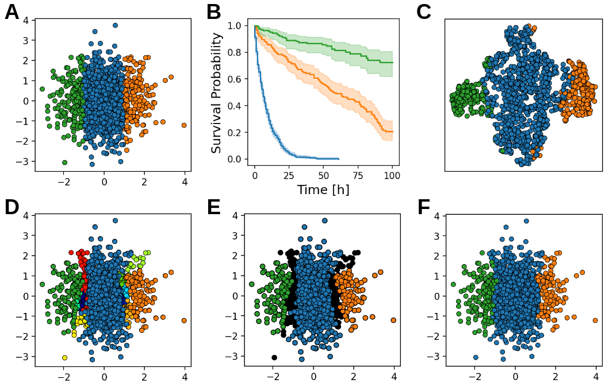

# Survival Hierarchical Agglomerative Clustering
This repository contains the code to run Survival Hierarchical Agglomerative Clustering (S-HAC), which was introduced in our paper [Survival Hierarchical Agglomerative Clustering: A Semi-Supervised Clustering Method Incorporating Survival Data](https://doi.org/10.1007/978-3-031-34344-5_1) accepted at the 21st International Conference of Artificial Intelligence in Medicine:

```latex
@InProceedings{10.1007/978-3-031-34344-5_1,
author="Lacki, Alexander
and Martinez-Millana, Antonio",
editor="Juarez, Jose M.
and Marcos, Mar
and Stiglic, Gregor
and Tucker, Allan",
title="Survival Hierarchical Agglomerative Clustering: A Semi-Supervised Clustering Method Incorporating Survival Data",
booktitle="Artificial Intelligence in Medicine",
year="2023",
publisher="Springer Nature Switzerland",
address="Cham",
pages="3--12",
abstract="Heterogeneity in patient populations presents a significant challenge for healthcare professionals, as different sub-populations may require individualized therapeutic approaches. To address this issue, clustering algorithms are often employed that identify patient groups with homogeneous characteristics. Clustering algorithms are mainly unsupervised, resulting in clusters that are biologically meaningful, but not necessarily correlated with a clinical or therapeutical outcome of interest.",
isbn="978-3-031-34344-5"
}
```



## Prerequisites
This code was tested on Python 3.7 using Ubuntu 18.04. 

The required Python packages can be installed using:
``` 
pip install -r requirements.txt
```

## Installation
Clone the repository and install it:
```
git clone https://github.com/alexander-lacki/Survival-Hierarchical-Agglomerative-Clustering
cd Survival-Hierarchical-Agglomerative-Clustering
cd s_hac
python setup.py install
```

## Usage
A Jupyter notebook demonstrating S-HAC on a simulated example is included in this reporistory. See `simulated_example.ipynb`.

### Object Initialization
```
from s_hac import SurvivalHierarchicalAgglomerativeClustering
shac = SurvivalHierarchicalAgglomerativeClustering(n_neighbors, alpha, min_cluster_size, logrank_p_threshold, processes)
```
Function arguments:
- `n_neighbors` defines how many nearest neighbors are used to create observation-specific survival curves. In our experience, a good starting point is 10-20% of the number of observations.
- `alpha` the contribution of the survival data to the distance computation. We generally use a value of `0.5`. A value of `1.0` would exclusively cluster on survival distance, whereas a value of `0.0` would only use covariate distance.
- `min_cluster_size` defines the threshold for accepting clusters. Clusters smaller than `min_cluster_size` are dissolved into singletons and absorbed by the remaining clusters. A good starting point is 10-20% of the number of observations.
- `logrank_p_threshold` defines the significance level of the logrank test. During agglomeration clusters that are candidates for merging according to the dendrogram, will only be merged if the difference between the survival times of the clusters is greater than `logrank_p_threshold`. A usual value would be `0.05`.
- `processes` defines the number of processes to use to compute the distance matrix.

### Prediction
```
predicted_labels = shac.fit_predict(x, y, precomputed_distance=None)
```
Function arguments:
- `x` a NumPy array of shape `(n, c)` with `n` being the number of observations in the dataset, and `c` being the number of covariates.
- `y` a list of NumPy arrays with survival data. Each NumPy array should have `n` rows, one for each observation, and columns should contain survival information `T` (observation duration) and `E` (event indicator). Each array in this list should correspond to a specific treatment or condition. If your data considers two treatment options, `y` will be a list of two NumPy arrays. Where treatment data is not available for individual observations, the the `T` and `E` entries should be set to `np.nan` and `0`, respectively.
- `precomputed_distance` allows for the passing of a precomputed covariate-based distance matrix. If `None`, a euclidean distance matrix will be computed.
